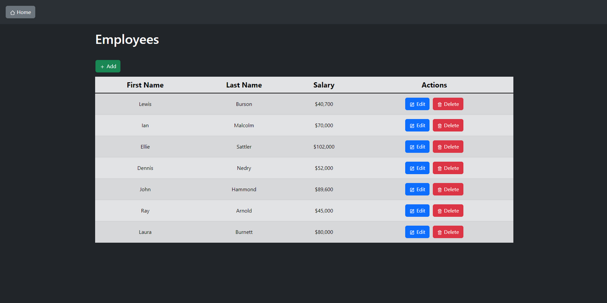
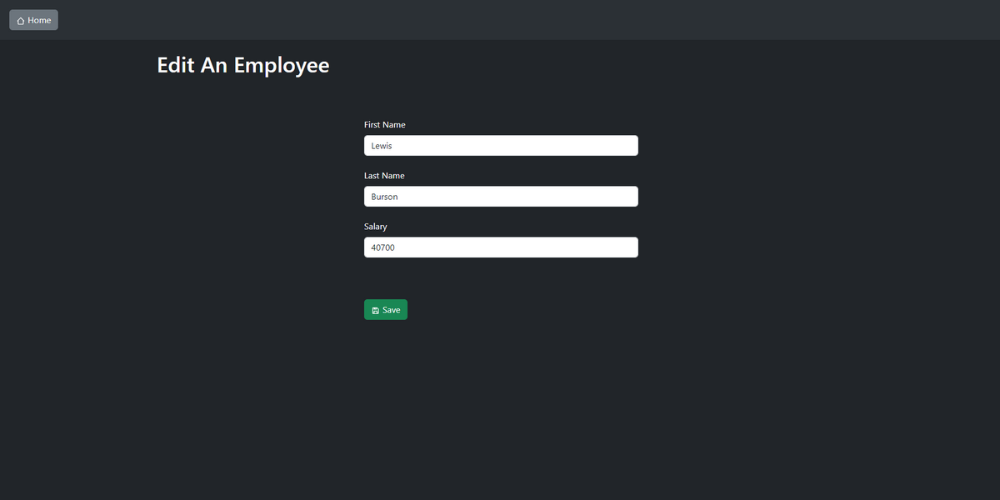
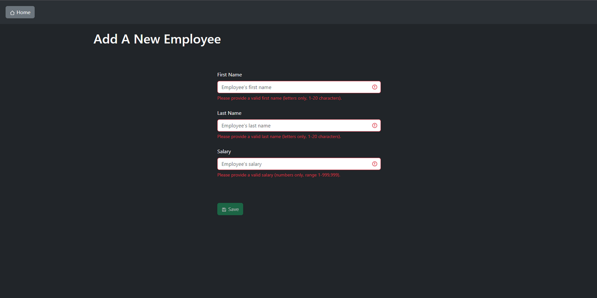

# Task

### Goal:

- Create an Employees table that shows employee first names, last names, and salaries.
- Use any front-end framework (Angular, React, Vue, ect...) or CSS library to accomplish this.
- Implement the back-end API with the back-end framework of your choice, and a SQL database.

### Functional Requirements:

- Initially, list all employees that are in the sample data.json.
- The ability to create a new employee.
- The ability to edit an employee.
- The ability to delete an employee.

### Technical Guidelines:

- Structure your application and components in a modular/reusable way.
- Commit code with useful and informative comments.
- Your application doesn't have to use the data.json file directly, but have a SQL script to initialize your database with data found in that file.
- Implement API code to read and write to a SQL database.
- Styling: CSS or SCSS or SASS can be used, whichever you prefer (can use popular UI frameworks like Bootstrap as well).

<br />

# Implementation

### Setup:

- Start up the frontend: in the frontend directory execute:

```bash
npm install
npm run dev
```

- Start up the backend: in the backend directory execute:

```bash
npm install
npm run devStart
```

- Start up the database: in the root directory execute:

```bash
docker compose up -d
```

### Future Considerations:

- Containerizing all micro services
- Testing
- Authentication
- Actions confirmations
- Search and Filters
- Sorting
- Pagination
- Reports
- Security (i.e SQL injection)
- Export and Import Data
- Add more employee fields
- Add enhanced options such as photo upload

### References:

- The app icon is taken from [Pixabay](https://pixabay.com/vectors/social-media-network-people-5508549/)

### Screenshots:



<hr/>



<hr/>


